# DESPLIEGUE — Evidencias y respuestas

Este documento recopila todas las evidencias y respuestas de la practica.

**NOTA**: Para la práctica he utiliza nginx y sftp como nombres de los contenedores.

---

## Parte 1 — Evidencias minimas

### Fase 1: Instalacion y configuracion


1) Servicio Nginx activo
 - Que demuestra: Muestra que el servicio Nginx está en ejecución dentro del entorno Docker.
 - Comando: docker compose ps
 - Evidencia: 

2) Configuracion cargada
 - Que demuestra: El archivo de configuración cargado.
 - Comando: "ls -l /etc/nginx/conf.d/" dentro del contenedor de nginx
 - Evidencia: 

3) Resolucion de nombres
 - Que demuestra: Demuestra que la web usa ese nombre.
 - Comando: En este caso no he utilizado comando, lo he verificado directamente en el navegador.
 - Evidencia: 

4) Contenido Web
 - Que demuestra: El contenido importado de Cloud Academy se muestra correctamente en la web.
 - Comando: En este caso no he utilizado comando, lo he verificado directamente en el navegador.
 - Evidencia: 

### Fase 2: Transferencia SFTP (Filezilla)

5) Conexion SFTP exitosa
 - Que demuestra: Conexión SFTP exitosa al servidor con FileZilla.
 - Comando: En este caso no he utilizado comando, lo he verificado con FileZilla.
 - Evidencia: 

6) Permisos de escritura
 - Que demuestra: Archivos subidos por SFTP sin problema de permisos.
 - Comando: En este caso no he utilizado comando, lo he verificado con FileZilla.
 - Evidencia: 

### Fase 3: Infraestructura Docker

7) Contenedores activos
 - Que demuestra: Los contenedores están arrancados.
 - Comando: docker compose ps
 - Evidencia: 

8) Persistencia (Volumen compartido)
 - Que demuestra: Los ficheros subidos via SFTP se sirven desde Nginx.
 - Comando: En este caso no he utilizado comando, lo he verificado directamente en el navegador y los ficheros con FileZilla.`
 - Evidencia: 

9) Despliegue multi-sitio
 - Que demuestra: La ruta "/reloj" está servida correctamente como sitio secundario.
 - Comando: En este caso no he utilizado comando, lo he verificado en el navegador.
 - Evidencia: 

### Fase 4: Seguridad HTTPS

10) Cifrado SSL
 - Que demuestra: HTTPS está activo, el puerto 8433 configurado y que el certificado está autofirmado.
 - Comando: En este caso no he utilizado comando, lo he verificado en el navegador.
 - Evidencia: 

11) Redireccion forzada
 - Que demuestra: Las peticiones HTTP son redirigidas a HTTPS con un 301 Moved Permanently.
 - Comando: En este caso no he utilizado comando, lo he verificado en el navegador en la pestaña network.
 - Evidencia: 

---

## Parte 2 — Evaluacion RA2 (a–j)

### a) Parametros de administracion
- Respuesta:

**1.** Evidencia de los fragmentos de los parametros de administración pedidos:
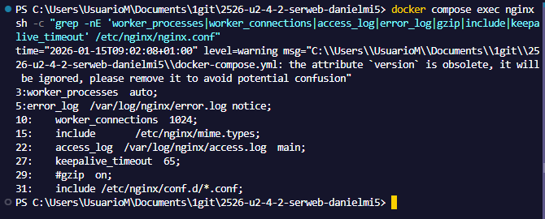

**2.** Directivas:

**worker_processes**
- Controla: Define el número de procesos de trabajo.
- Configuración realista incorrecta: Poniendo un valor negativo (ej -1).
- Lo comprobaría mediante el comando "docker compose exec nginx nginx -t" que valida la configuración, la evidencia se encuentra al final de este punto.

**worker_connections**
- Controla: Establece el número máximo de conexiones simultáneas que puede ser abierto por un proceso de trabajo.
- Configuración realista incorrecta: Poniendo un valor negativo (ej -1).
- Lo comprobaría mediante el comando "docker compose exec nginx nginx -t" que valida la configuración, la evidencia se encuentra al final de este punto.

**access_log**
- Controla: Define archivos de log de acceso específicos para el sitio.
- Configuración realista incorrecta: Da error si se pone ningun valor.
- Lo comprobaría mediante el comando "docker compose exec nginx nginx -t" que valida la configuración, la evidencia se encuentra al final de este punto.

**error_log**
- Controla: Define archivos de log de error específicos para el sitio.
- Configuración realista incorrecta: Da error si no se pone ningún valor.
- Lo comprobaría mediante el comando "docker compose exec nginx nginx -t" que valida la configuración, la evidencia se encuentra al final de este punto.

**keepalive_timeout**
- Controla: establece un tiempo de espera durante el cual una conexión del cliente viva permanecerá abierta en el lado del servidor.
- Configuración realista incorrecta: Poniendo un valor negativo (ej -35)
- Lo comprobaría mediante el comando "docker compose exec nginx nginx -t" que valida la configuración, la evidencia se encuentra al final de este punto.

**include**
- Controla: Para incluir configuraciones adicionales
- Configuración realista incorrecta: Da error si no se incluye ningún valor.
- Lo comprobaría mediante el comando "docker compose exec nginx nginx -t" que valida la configuración, la evidencia se encuentra al final de este punto.

**gzip**
- Controla: Permite la compresión.
- Configuración realista incorrecta: Cualquier valor que no sea on y off.
- Lo comprobaría mediante el comando "docker compose exec nginx nginx -t" que valida la configuración, la evidencia se encuentra al final de este punto.

Para comprobar si la configuración es correcta utilizaría este comando "docker compose exec nginx nginx -t" que valida la configuración.

Evidencia de la validación de la configuración incorrecta:
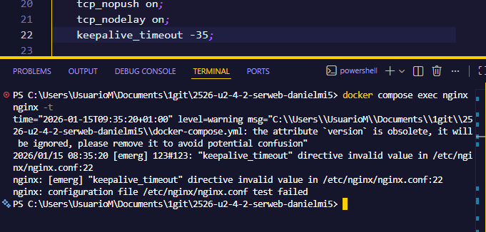

**3.** Cambio seguro y reload:

He ajustado keepalive_timeout de 65 a 35 editando el nginx.conf local. Y he recargado la configuración de nginx mediante el comando "docker compose exec nginx nginx -s reload"

Evidencia del cambio y la recarga:


- Evidencias:
  - evidencias/a-01-grep-nginxconf.png
  - evidencias/a-02-nginx-t.png
  - evidencias/a-03-reload.png

### b) Ampliacion de funcionalidad + modulo investigado
- Opcion elegida (B1 o B2):
- Respuesta: Se ha elegido la tarea B1

Se ha configurado gzip en el archivo gzip.conf y este es su contenido:  
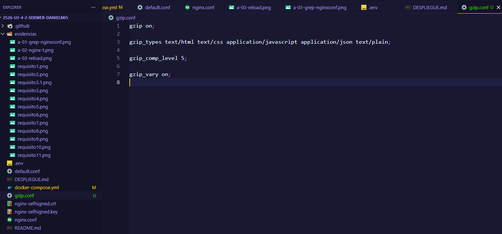

Se ha montado gzip.conf en docker-compose.yml  
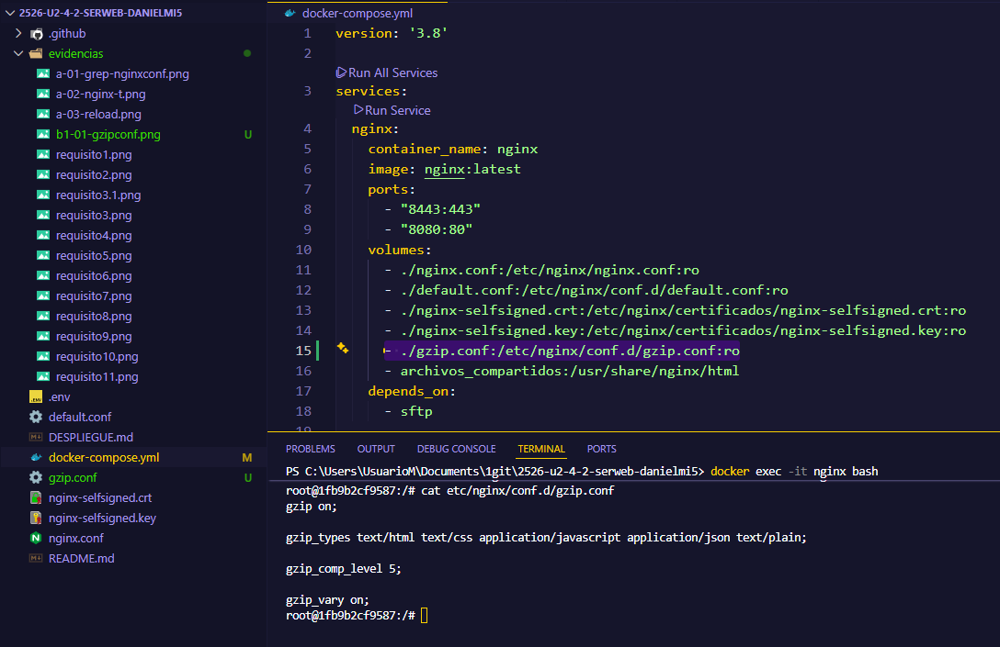

Evidencia de configuración validada mediante el comando "docker compose exec nginx nginx -t":  
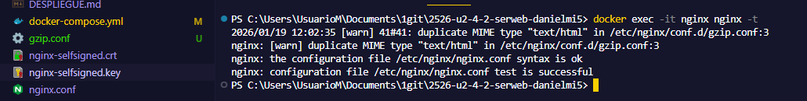

Evidencia de Content-Encoding: gzip en la respuesta:  
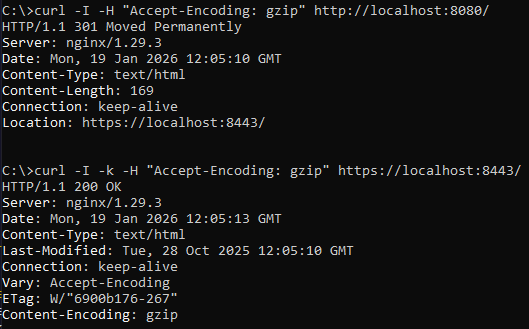  

- Evidencias (B1 o B2):
  - evidencias/b1-01-gzipconf.png
  - evidencias/b1-02-compose-volume-gzip.png
  - evidencias/b1-03-nginx-t.png
  - evidencias/b1-04-curl-gzip.png
  - evidencias/b2-01-defaultconf-headers.png
  - evidencias/b2-02-nginx-t.png
  - evidencias/b2-03-curl-https-headers.png

#### Modulo investigado: <ngx_http_mp4_module>
- **Para que sirve**: proporciona soporte para pseudo-streaming de archivos MP4 (.mp4, .m4v o .m4a). Su función principal es permitir que los reproductores de video salten a una posición específica de un video sin necesidad de descargar el archivo completo previamente: `http://example.com/elephants_dream.mp4?start=238.88`.

- **Como se instala/carga**: Debe habilitarse explícitamente al configurar la compilación de nginx usando el parámetro: `--with-http_mp4_module`.

- **Ejemplo de configuración**:

```
Ubicación /video/ {
    mp4;
    mp4_buffer_size 1m;
    mp4_max_buffer_size 5m;
    mp4_limit_rate en;
    mp4_limit_rate_después de los 30s;
}
```

- **Fuente(s)**: [Documentación oficial nginx](https://nginx.org/en/docs/http/ngx_http_mp4_module.html)

### c) Sitios virtuales / multi-sitio
- Respuesta:

**Diferencia entre multi-sitio por path y por nombre (server_name):**

Multi-sitio por path utiliza un bloque server para gestionar todo el tráfico bajo un mismo dominio, configurando los servicios mediante directivas location según la ruta de la URL (como los usados /admin o /reloj). En cambio, multi-sitio por nombre define bloques server independientes que responden a distintos dominios especificados en la directiva server_name.

**Indica al menos 2 tipos adicionales de multi-sitio:**

- Por puerto, utilizando la directiva listen.
- Por ip, utilizando también la directiva listen.

Evidencias del multi.sitio por path funcionando:  


Evidencia de la configuración del archivo default.conf, usando el comando "docker compose exec nginx sh -c "sed -n '1,220p' /etc/nginx/conf.d/default.conf":  


Las directivas clave son: 

- **root**: especifica la raíz del contenido que Nginx sirve.
- **location**: define rutas URL que aplican reglas específicas.
- **try_files**: intenta servir un fichero o directorio y, si no existe, devuelve 404.
- **location /reloj**: define "root /usr/share/nginx/html" e "index index.html index htm", además de un "try_files".

- Evidencias:
  - evidencias/c-01-root.png
  - evidencias/c-02-reloj.png
  - evidencias/c-03-defaultconf-inside.png


### d) Autenticacion y control de acceso
- Respuesta:
Se creó el archivo index.html en webdata/admin/ con contenido simple.

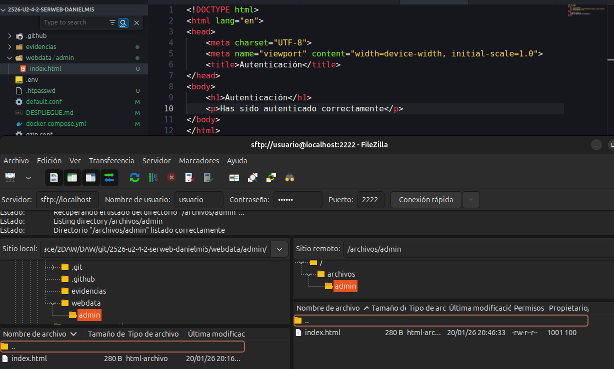

Además, se ha creado el archivo -htpasswd con el comando `htpasswd -c .htpasswd daniel` y contraseña admin123 (Este archivo se monta en el contenedor nginx -> "./.htpasswd:/etc/nginx/.htpasswd:ro"). Se ha configurado auth_basic para /admin/ con el archivo anterior:

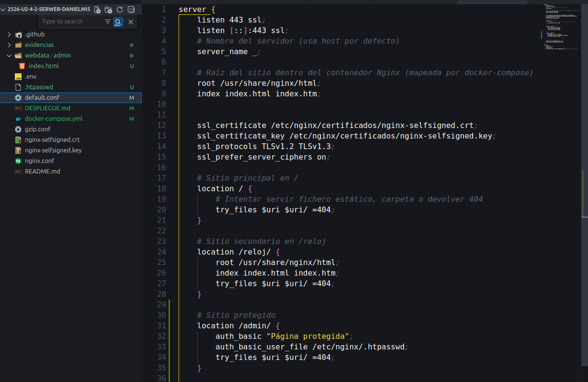

Evidencia de acceso sin credenciales devolviendo 401 con el comando "curl -I -k https://localhost:8443/admin/":  
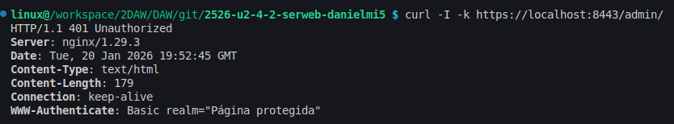

Evidencia de acceso con credenciales devolviendo 200 con el comando "curl -I -k -u daniel:admin123 https://localhost:8443/admin/":  
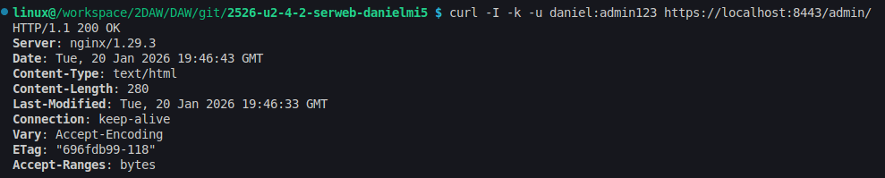


- Evidencias:
  - evidencias/d-01-admin-html.png
  - evidencias/d-02-defaultconf-auth.png
  - evidencias/d-03-curl-401.png
  - evidencias/d-04-curl-200.png


### e) Certificados digitales
- Respuesta:


**¿Qué es .crt y .key?**

El .crt (público) es el certificado del sitio web, contiene el nombre del dominio, la fecha de caducidad y quién emitió el certificado. El .key (privada) es una clave para descifrar la información que los usuarios envían al servidor.


**¿Por qué -nodes se usa en laboratorio?**
Porque es más sencillo y cómodo para realizar pruebas sim tener que meter la contraseña manualmente. Si no se utiliza, la clave se protege mediante una contraseña. Y usando -nodes la clave se guarda en texto plano sin necesitar la contraseña para acceder.


Evidencia de ficheros .crt y .key generados: 
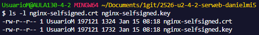

Evidencia de montaje en docker compose:  
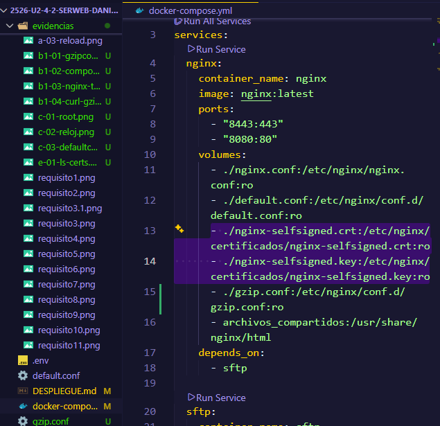

Evidencia de configuración añadida al archivo default.conf:  
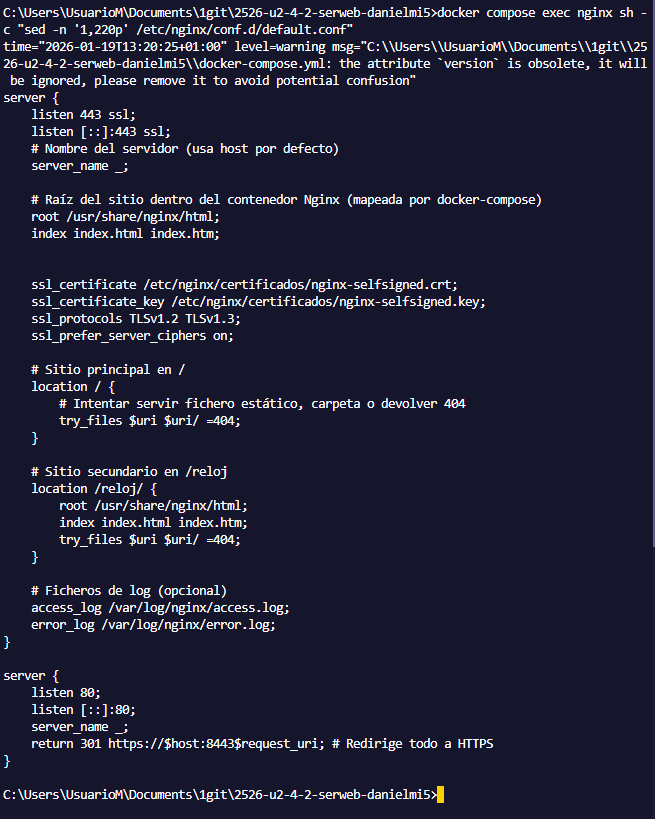

- Evidencias:
  - evidencias/e-01-ls-certs.png
  - evidencias/e-02-compose-certs.png
  - evidencias/e-03-defaultconf-ssl.png


### f) Comunicaciones seguras
- Respuesta:

Evidencia de HTTPS operativo:  


Evidencia de la redirección HTTP-->HTTPS con 301: 


**¿Por qué se usan dos server blocks (80 redirige, 443 sirve)?**
En HTTP se escucha en el puerto 80 sin cifrar y se usa para obtener peticiones iniciales, ese bloque solo hace una redirección hacia la versión segura para obligar HTTPS. Y el bloque en 443 gestiona las conexiones cifradas con el certificado y las configuraciones específicas de seguridad, separando responsabilidades.


- Evidencias:
  - evidencias/f-01-https.png
  - evidencias/f-02-301-network.png


### g) Documentacion
- Respuesta:

**Arquitectura**

- Servicios: 
  - nginx: contenedor principal que sirve el contenido web y gestiona HTTPS/HTTP. Imagen: nginx:latest. Depende de sftp para disponer de los ficheros subidos.
  - sftp: servidor SFTP para transferencia de ficheros (usado FileZilla). Imagen: atmoz/sftp.

- Puertos mapeados(host:contenedor):
  - 8443:443: HTTPS.
  - 8080:80: HTTP.
  - 2222:22: SFTP.

- Volúmenes:
  - archivos_compartidos: volumen nombrado compartido entre `sftp` y `nginx`.
    
  - Bind mounts (ro: solo lectura):
    - ./nginx.conf:/etc/nginx/nginx.conf:ro
    - ./default.conf:/etc/nginx/conf.d/default.conf:ro
    - ./gzip.conf:/etc/nginx/conf.d/gzip.conf:ro
    - ./nginx-selfsigned.crt:/etc/nginx/certificados/nginx-selfsigned.crt:ro
    - ./nginx-selfsigned.key:/etc/nginx/certificados/nginx-selfsigned.key:ro
    - ./.htpasswd:/etc/nginx/.htpasswd:ro.

**Seguridad**

- Certificados: nginx-selfsigned.crt y nginx-selfsigned.key se montan en /etc/nginx/certificados. HTTPS está expuesto en el host en el puerto 8443 (map 8443:443).
- Redirección: el bloque en puerto 80 realiza una redirección 301 hacia la versión HTTPS obligatoria.
- Opción B elegida: B1 (gzip): gzip configurado en gzip.conf y montado en /etc/nginx/conf.d/gzip.conf para comprimir respuestas.

**Autenticación /admin**

- Se ha habilitado auth_basic para la ruta /admin usando un archivo .htpasswd montado en /etc/nginx/.htpasswd:ro. Sin credenciales devuelve 401 y con credenciales válidas devuelve 200.

**Logs y análisis (criterio j)**

Acceso a logs de los contenedores mediante: docker compose logs. Para análisis se emplearon comandos que peticiones, para luego extraer sus métricas

**Evidencias Parte 1**

- requisito1-11.png

**Evidencias Parte 2**

- a-01-grep-nginxconf.png  a-02-nginx-t.png  a-03-reload.png
- b1-01-gzipconf.png  b1-02-compose-volume-gzip.png  b1-03-nginx-t.png  b1-04-curl-gzip.png
- c-01-root.png  c-02-reloj.png  c-03-defaultconf-inside.png
- d-01-admin-html.png  d-02-defaultconf-auth.png  d-03-curl-401.png  d-04-curl-200.png
- e-01-ls-certs.png  e-02-compose-certs.png  e-03-defaultconf-ssl.png
- f-01-https.png  f-02-301-network.png
- h-01-root.png  h-02-reloj.png
- i-01-compose-ps.png
- j-01-logs-follow.png  j-02-metricas.png

Todas las capturas están disponibles en la carpeta evidencias y en la checklist están también.

### h) Ajustes para implantacion de apps
- Respuesta:

**Explica que implica desplegar una segunda app en /reloj (rutas relativas/absolutas).**
Al ser un subdirectorio de la raíz /, implica que hay que adaptar las rutas: los enlaces a css/js/imágenes no deben usar rutas absolutas si no que tienen que usar rutas relativas.

**Describe un problema tipico de permisos al subir por SFTP y tu solucion.**

Un problema es no tener permisos de escritura en el directorio destino del servidor SFTP. Para solucionarlo ejecuté el siguiente comando:
`docker exec -it sftp chmod -R 777 /home/usuario/archivos`
Utilicé este comando para otorgar permisos totales para permitir la transferencia vía SFTP a ese destino.


Evidencias de / y /reloj funcionando:


- Evidencias:
  - evidencias/h-01-root.png
  - evidencias/h-02-reloj.png


### i) Virtualizacion en despliegue
- Respuesta:

**Explica diferencia operativa entre instalacion nativa en SO y contenedor efimero + configuracion por volumenes.**

Al intalar en SO, el programa, las dependencias y los datos se guarda todo en el SO. En cambio, mediante contenedor todos los servicios quedan aislados por lo que el programa no toca el SO, ni los archivos innecesarios como las dependencias se quedan guardados, lo que lo hace fácil de eliminar sin dejar rastro y solo se guardan fuera los datos en volúmenes.

Evidencia de contenedores en marcha:  


- Evidencias:
  - evidencias/i-01-compose-ps.png

### j) Logs: monitorizacion y analisis
- Respuesta:

Se ha generado tráfico y errores 404 mediante estos comandos: 
```bash
for i in $(seq 1 20); do curl -s -o /dev/null http://localhost:8080/; done
for i in $(seq 1 10); do curl -s -o /dev/null http://localhost:8080/no-existe-$i; done
```
Evidencia de monitorización en tiempo real:  
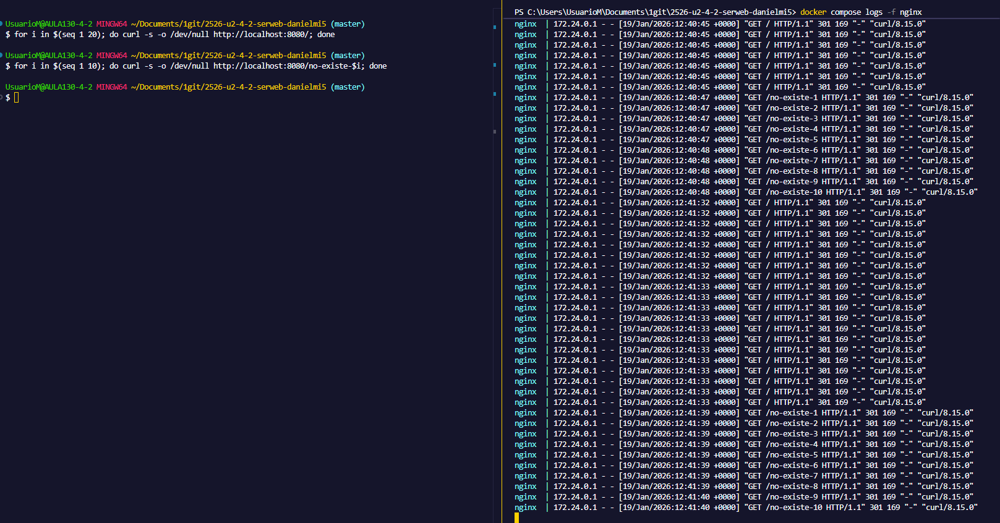

Comandos utilizados para obtener los logs de las métricas:
```bash
docker compose logs nginx | awk '{print $7}' | sort | uniq -c | sort -nr | head
docker compose logs nginx | awk '{print $9}' | sort | uniq -c | sort -nr | head
docker compose logs nginx --no-log-prefix | awk '$9==404 {print $7}' | sort | uniq -c | sort -nr | head
```

Evidencia de la extracción sw metricas basicas (top URLs, codigos, 404) desde el contenedor.

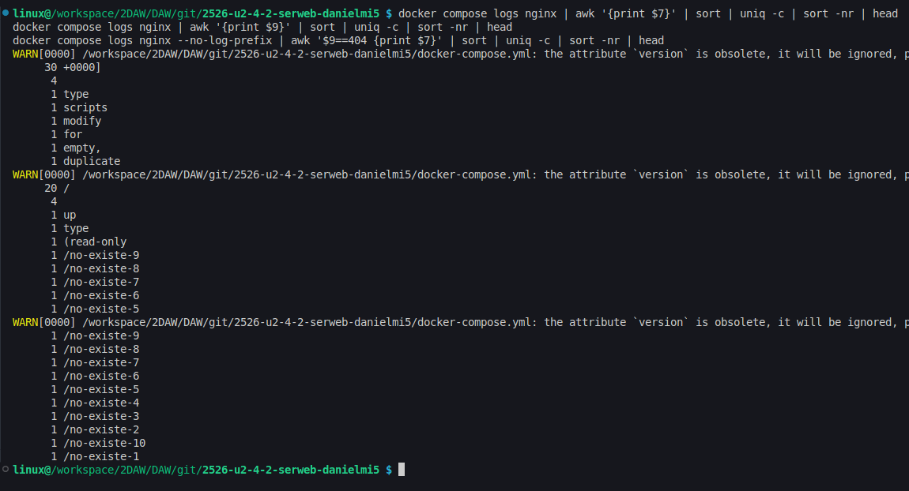

- Evidencias:
  - evidencias/j-01-logs-follow.png
  - evidencias/j-02-metricas.png

---

## Checklist final

### Parte 1
- [✅] 1) Servicio Nginx activo
  - Evidencia: 
- [✅] 2) Configuracion cargada
  - Evidencia: 
- [✅] 3) Resolucion de nombres
  - Evidencia: 
- [✅] 4) Contenido Web (Cloud Academy)
  - Evidencia: 
- [✅] 5) Conexion SFTP exitosa
  - Evidencia: 
- [✅] 6) Permisos de escritura
  - Evidencia: 
- [✅] 7) Contenedores activos
  - Evidencia: 
- [✅] 8) Persistencia (Volumen compartido)
  - Evidencia: 
- [✅] 9) Despliegue multi-sitio (/reloj)
  - Evidencia: 
- [✅] 10) Cifrado SSL
  - Evidencia: 
- [✅] 11) Redireccion forzada (301)
  - Evidencia: 

### Parte 2 (RA2)
- [✅] a) Parametros de administracion
  - Evidencias:   
- [✅] b) Ampliacion de funcionalidad + modulo investigado
  - Evidencias:    
- [✅] c) Sitios virtuales / multi-sitio
  - Evidencias:   
- [✅] d) Autenticacion y control de acceso
  - Evidencias:    
- [✅] e) Certificados digitales
  - Evidencias:   
- [✅] f) Comunicaciones seguras
  - Evidencias:  
- [✅] g) Documentacion
  - Evidencias: carpeta `evidencias/` con todas las capturas
- [✅] h) Ajustes para implantacion de apps
  - Evidencias:  
- [✅] i) Virtualizacion en despliegue
  - Evidencia: 
- [✅] j) Logs: monitorizacion y analisis
  - Evidencias:  
